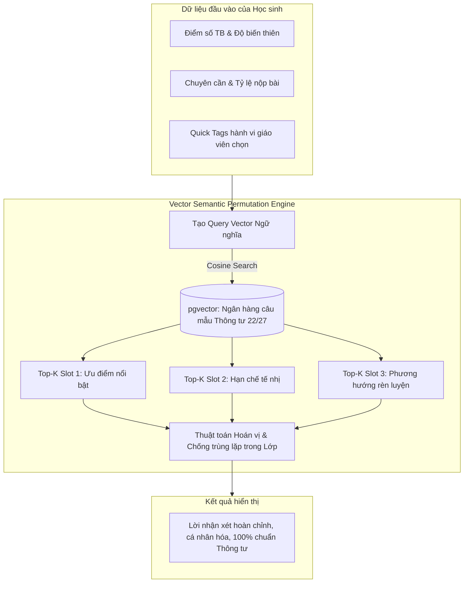

# TỬ HUYỆT 01: ÁC MỘNG "VIẾT LỜI NHẬN XÉT HỌC SINH" (THÔNG TƯ 22 & 27) & GIẢI PHÁP VECTOR SEMANTIC ENGINE (CHI PHÍ 0 ĐỒNG)

> **Mã hồ sơ:** `PAIN-POINT-01`  
> **Phân loại:** Trải nghiệm Giáo viên (Teacher Experience & Operational Burden)  
> **Giải pháp kỹ thuật:** Vector Semantic Retrieval + Slot-Filling + Dynamic Permutation Engine (`pgvector`)  
> **Chi phí vận hành:** ~ 0 VNĐ (Không tiêu tốn token của Generative LLM)

---

## 1. BÓC TÁCH CHI TIẾT NỖI ĐAU (THE REAL PAIN POINT)

### 1.1. Bối cảnh pháp lý khắt khe của Chương trình GDPT 2018
Từ khi Bộ Giáo dục và Đào tạo ban hành **Thông tư 27/2020/TT-BGDĐT** (đối với Tiểu học) và **Thông tư 22/2021/TT-BGDĐT** (đối với THCS & THPT), phương thức đánh giá học sinh tại Việt Nam đã thay đổi 180 độ:
- Bỏ đánh giá thuần túy bằng điểm số đơn lẻ.
- **Bắt buộc phải có LỜI NHẬN XÉT ĐỊNH TÍNH** về cả *Năng lực học tập* và *Phẩm chất đạo đức* cho từng học sinh vào sổ theo dõi và học bạ điện tử cuối mỗi học kỳ.

### 1.2. Các quy tắc sư phạm bất di bất dịch
1. **Quy tắc 3 thành phần bắt buộc:** Lời nhận xét đạt chuẩn thanh tra phải đủ cấu trúc:
   $$\text{Lời nhận xét} = [\text{Ưu điểm nổi bật}] + [\text{Hạn chế tế nhị}] + [\text{Phương hướng rèn luyện}]$$
2. **Cấm dùng từ ngữ tiêu cực:** Tuyệt đối không dùng các từ mang tính phán xét, hạ thấp học sinh như: *học dốt, lười biếng, yếu kém, chậm chạp, hư hỏng...* Phải dùng văn phong khéo léo, mang tính xây dựng.
3. **Cá nhân hóa:** Không được rập khuôn một câu giống nhau cho cả lớp.

### 1.3. Khủng hoảng thực tế: Sự kiệt sức của Giáo viên
- Một giáo viên bộ môn (như Tiếng Anh, Lịch sử - Địa lý, KHTN, Tin học, GDCD) phụ trách trung bình từ **6 đến 8 lớp** (mỗi lớp 40 - 45 học sinh).
- Tổng số lượng học sinh phải nhận xét mỗi kỳ: **350 - 450 học sinh/giáo viên**.
- **Hệ quả bi hài:**
  - Thời hạn chốt sổ điểm của nhà trường chỉ kéo dài 7 - 10 ngày. Giáo viên phải thức trắng đêm đến 1-2h sáng gõ chữ.
  - Quá tải dẫn đến việc giáo viên tải các file Excel mẫu trên mạng về copy-paste hàng loạt, dẫn đến các sai phạm tai hại: Học sinh nam bị nhận xét *"Em nết na, khéo tay"*, học sinh giỏi Toán bị ghi *"Cần cố gắng học thuộc bảng cửu chương"*, học sinh nghịch nhất lớp bị ghi *"Rụt rè, ít nói"*. Khi phụ huynh đọc học bạ, họ bức xúc bêu lên mạng xã hội, làm tổn hại uy tín nhà trường.

### 1.4. Tại sao các hệ thống hiện nay (vnEdu, SMAS) đều thất bại?
- **vnEdu / SMAS:** Chỉ cung cấp một ô Text Box trống trơn để giáo viên tự gõ tay, hoặc cung cấp sẵn 10 - 20 câu mẫu nghèo nàn, sáo rỗng. Cả lớp 45 em thì 30 em có chung một câu: *"Em tiếp thu bài tốt, cần rèn luyện thêm"*.

---

## 2. PHÂN TÍCH GIẢI PHÁP: TẠI SAO DÙNG VECTOR MÀ KHÔNG DÙNG GENERATIVE LLM?

### 2.1. Cái bẫy của việc dùng Generative LLM (GPT-4 / Gemini / Claude)
Nếu mỗi học sinh đều gọi API sinh văn bản tự do của OpenAI / Gemini:
1. **Chi phí khủng khiếp:** Một trường học có $1.500 \text{ học sinh} \times 10 \text{ môn} = 15.000 \text{ lượt gọi API}$. Với 1.000 trường học trên cả nước vào tuần cao điểm cuối kỳ, hệ thống sẽ thực hiện **15 triệu lượt gọi LLM**, tiêu tốn hàng trăm triệu đến hàng tỷ đồng tiền token API.
2. **Nguy cơ Ảo giác (Hallucination):** LLM tự do có thể "lỡ lời" sinh ra những từ ngữ vi phạm điều cấm của Thông tư 22/27, gây rủi ro pháp lý nghiêm trọng cho giáo viên khi thanh tra.
3. **Độ trễ (Latency):** Sinh văn bản mất 2 - 4 giây/học sinh. Giáo viên bấm "Nhận xét cả lớp 45 em" sẽ phải chờ quay vòng tròn từ 2 - 3 phút, trải nghiệm rất ức chế.

### 2.2. Sự vượt trội của Vector Semantic Engine (pgvector)
- **Chi phí Token:** **0 VNĐ** (Không tiêu tốn bất kỳ token sinh văn bản nào trong quá trình vận hành).
- **Tốc độ:** **< 10 mili-giây / 1 học sinh**. Cả lớp 45 học sinh được xử lý xong trong **chưa đầy 0.5 giây**.
- **Độ an toàn sư phạm:** **100% Tuyệt đối** vì toàn bộ ngân hàng câu mẫu đã được thẩm định chuẩn mực.
- **Hoạt động Offline/Nội bộ:** Chạy hoàn toàn ngay trong PostgreSQL của Schoolify (`pgvector`), không phụ thuộc Internet quốc tế hay API bên ngoài.

---

## 3. THIẾT KẾ KIẾN TRÚC KỸ THUẬT CỦA SCHOOLIFY



### 3.1. Database Schema cho Ngân hàng Ngữ liệu Vector (`schema.prisma`)

```prisma
enum CommentSlotType {
  STRENGTH      // Slot 1: Ưu điểm nổi bật
  LIMITATION    // Slot 2: Hạn chế cần khắc phục (tế nhị)
  RECOMMENDATION // Slot 3: Phương hướng rèn luyện & khích lệ
}

enum PerformanceBracket {
  EXCELLENT   // Tốt / Giỏi (Điểm 9 - 10)
  GOOD        // Khá (Điểm 7 - 8.9)
  AVERAGE     // Đạt / Trung bình (Điểm 5 - 6.9)
  STRUGGLING  // Chưa đạt / Cần cố gắng (Điểm < 5)
}

model PedagogicalPhrase {
  id               String              @id @default(uuid())
  slot_type        CommentSlotType
  bracket          PerformanceBracket
  behavior_tag     String              // 'phat_bieu', 'mat_tap_trung', 'can_than', 'sang_tao'...
  subject_category String?             // 'MATH', 'LITERATURE', 'NATURAL_SCIENCES', 'ALL'
  content          String              // Câu mẫu chuẩn sư phạm
  embedding        Unsupported("vector(384)")? // Vector nhúng ngữ nghĩa (e.g. bge-m3 / multilingual-e5)
  usage_count      Int                 @default(0)
  created_at       DateTime            @default(now())

  @@index([slot_type, bracket, behavior_tag])
}
```

### 3.2. Cấu trúc 3 Slot Ngữ liệu (Atomic Sentences)
- **Kho ngữ liệu ban đầu:** Khoảng 1.500 - 2.000 mệnh đề nguyên tử được viết sẵn bởi các giáo viên cốt cán:
  - **Slot 1 (Ưu điểm):**
    - `"Có năng khiếu tư duy logic và nắm bắt kiến thức bài học rất nhanh"`
    - `"Thái độ học tập nghiêm túc, tích cực hăng hái xây dựng bài trên lớp"`
    - `"Kỹ năng làm việc nhóm tốt, luôn sẵn sàng hỗ trợ các bạn cùng tiến bộ"`
  - **Slot 2 (Hạn chế tế nhị - Nói khéo không dùng từ cấm):**
    - `"Đôi khi còn có phần nóng vội trong các bước trình bày chi tiết"`
    - `"Cần phân bổ thời gian làm bài tập hợp lý hơn để tránh sai sót nhỏ"`
    - `"Còn có phần dè dặt khi phát biểu ý kiến cá nhân trước tập thể"`
  - **Slot 3 (Phương hướng rèn luyện & Khích lệ):**
    - `"Nếu rèn thêm tính cẩn thận, em chắc chắn sẽ đạt thành tích nổi bật hơn nữa"`
    - `"Thầy/Cô tin tưởng em sẽ tiếp tục duy trì và bứt phá mạnh mẽ trong học kỳ tới"`
    - `"Cần chủ động trao đổi với thầy cô khi gặp các bài toán vận dụng cao"`

### 3.3. Thuật toán Ghép nối & Chống trùng lặp trong Lớp (Anti-Collision Algorithm)
1. **Bước 1 (Xác định Vector ngữ nghĩa):** Dựa trên mức điểm và 1-2 Quick Tags của học sinh, hệ thống tìm Top-5 câu có khoảng cách Cosine nhỏ nhất (`<=>`) trong `pgvector` cho từng Slot.
2. **Bước 2 (Kiểm tra trùng lặp trong lớp):**
   - Hệ thống duy trì một mảng bộ nhớ đệm `UsedPhraseIdsInClass = Set()`.
   - Với mỗi học sinh, thuật toán chọn câu có rank cao nhất **chưa từng xuất hiện** trong danh sách học sinh của lớp hiện tại.
3. **Bước 3 (Biến thiên Liên từ nối - Transition Connectors):**
   - Tự động xáo trộn các liên từ kết nối giữa Slot 1 và Slot 2:
     - Biến thể 1: `[Slot 1]. Tuy nhiên, [Slot 2]. [Slot 3].`
     - Biến thể 2: `[Slot 1], bên cạnh đó [Slot 2]. [Slot 3].`
     - Biến thể 3: `[Slot 1]. Thầy/Cô lưu ý em [Slot 2]; [Slot 3].`
- **Kết quả:** Với $5 \text{ câu Slot 1} \times 5 \text{ câu Slot 2} \times 5 \text{ câu Slot 3} \times 4 \text{ kiểu liên từ} = \mathbf{500 \text{ cách diễn đạt hoàn toàn khác nhau}}$ cho cùng một nhóm học sinh có cùng học lực, đảm bảo không bao giờ có 2 em bị trùng lặp!

---

## 4. THIẾT KẾ TRẢI NGHIỆM NGƯỜI DÙNG (FRONTEND UX FLOW)

```
+---------------------------------------------------------------------------------------+
|  DANH SÁCH NHẬN XÉT HỌC KỲ - LỚP 8A (MÔN TOÁN)                                        |
|  [ Nút: 🚀 AI Tự Động Gợi Ý Toàn Bộ 45 Học Sinh (1-Click) ]                           |
+----+-------------------+-------+-----------------------+-----------------------------+
| STT| Họ và Tên         | ĐTB   | Quick Tags (Chọn nhanh| Lời Nhận Xét Được Tạo      |
+----+-------------------+-------+-----------------------+-----------------------------+
| 1  | Nguyễn Văn An     | 8.6   | [x] Hăng hái [ ] Cẩn  | Tiếp thu bài nhanh và tư duy|
|    |                   |       | thận [x] Nói chuyện   | hình học tốt. Tuy nhiên đôi |
|    |                   |       |                       | khi còn thiếu tập trung. Rèn|
|    |                   |       |                       | thêm tính kiên nhẫn sẽ xuất |
|    |                   |       |                       | sắc hơn. [🔄 Đổi câu khác]  |
+----+-------------------+-------+-----------------------+-----------------------------+
| 2  | Trần Thị Bình     | 8.5   | [x] Chăm chỉ [x] Trầm | Nắm chắc kiến thức, thái độ |
|    |                   |       | tính                  | học tập nghiêm túc. Cần tự  |
|    |                   |       |                       | tin hơn khi phát biểu trước |
|    |                   |       |                       | lớp để phát huy tối đa năng |
|    |                   |       |                       | lực.     [🔄 Đổi câu khác]  |
+----+-------------------+-------+-----------------------+-----------------------------+
```

- **Nút "Đổi câu khác (Reroll)" tức thì:** Nếu giáo viên thấy chưa ưng ý, bấm icon 🔄 là hệ thống bốc câu rank tiếp theo trong vector pool trong 10ms, không mất thời gian gõ lại.

---

## 5. GIÁ TRỊ THƯƠNG MẠI & ĐÒN BẨY BÁN HÀNG (SALES PITCH)

1. **Đòn bẩy bán hàng trực tiếp đến Giáo viên (Product-Led Growth):**
   - Khi đi chào trường, chỉ cần demo trực tiếp tính năng này cho 3 giáo viên xem: *"Thầy cô chỉ cần bấm 1 nút, hệ thống làm xong nhận xét cho 400 học sinh trong 10 giây, chuẩn 100% Thông tư 22"*. Giáo viên sẽ lập tức trở thành người thuyết phục Hiệu trưởng mua Schoolify.
2. **Tiết kiệm chi phí vận hành cho Schoolify:**
   - Hoàn toàn độc lập, không phải thanh toán hóa đơn OpenAI/Anthropic hàng tháng. Tỷ suất lợi nhuận đạt mức tối đa.
3. **Giá trị thương hiệu:**
   - Truyền thông mạnh mẽ: *"Schoolify - Nền tảng ứng dụng Trí tuệ Nhân tạo Semantic Vector giảm 95% áp lực sổ sách học bạ cho nhà giáo Việt Nam"*.

---

> **TRẠNG THÁI HỒ SƠ:** ĐÃ DUYỆT CHIẾN LƯỢC & KIẾN TRÚC KỸ THUẬT  
> **Kế hoạch tiếp theo:** Xây dựng module `PedagogicalPhrase` trong schema và triển khai thuật toán truy vấn pgvector trong backend.
