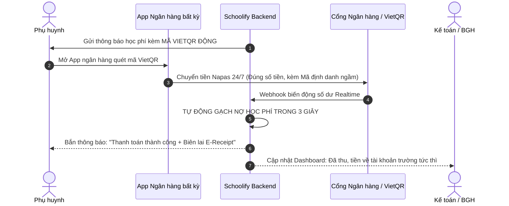

# TỬ HUYỆT 02: NỖI ÁC MỘNG "THU HỌC PHÍ & ĐỐI SOÁT CÔNG NỢ" VÀ GIẢI PHÁP TỰ ĐỘNG HÓA 100% BẰNG VIETQR ĐỘNG

> **Mã hồ sơ:** `PAIN-POINT-02`  
> **Phân loại:** Tài chính Giáo dục & Tự động hóa Vận hành (Fintech & Educational Operations)  
> **Giải pháp kỹ thuật:** Dynamic VietQR (Napas 24/7) + Virtual Account (Tài khoản định danh) + Real-time Webhook Auto-Reconciliation  
> **Mục tiêu:** Cắt giảm 100% việc đòi nợ của Giáo viên, tự động gạch nợ trong 3 giây, giải phóng Kế toán nhà trường.

---

## 1. BÓC TÁCH BẢN CHẤT NỖI ĐAU THỰC TẾ (THE NIGHTMARE OF TUITION COLLECTION)

Thu học phí tại các trường học và trung tâm đào tạo ở Việt Nam hiện nay đang là một **"bãi chiến trường hỗn loạn"** cho cả 4 bên: Giáo viên, Kế toán, Ban giám hiệu và Phụ huynh.

```
+-----------------------------------------------------------------------------------------------+
|                      THỰC TRẠNG THU HỌC PHÍ THỦ CÔNG HIỆN NAY                                 |
|                                                                                               |
|  [Phụ huynh CK ngân hàng]                                                                     |
|  Nội dung CK: "Nguyen Van A ck tien", "Me Tom nop tien hoc", "Chuyen tien thang 9"           |
|                       |                                                                       |
|                       v                                                                       |
|  [Chụp ảnh màn hình CK] ---> [Gửi Zalo cho Cô giáo]                                           |
|                                     |                                                         |
|                                     v                                                         |
|  [Cô giáo & Kế toán]: Ngồi zoom từng ảnh chụp màn hình, mở sao kê ngân hàng dày hàng trăm     |
|                       trang, căng mắt dò từng món tiền -> Nhầm lẫn, cãi vã, mất tiền!         |
+-----------------------------------------------------------------------------------------------+
```

### 1.1. Nỗi khổ của Giáo viên chủ nhiệm: Biến thành "Người đi đòi nợ thuê"
- Đầu mỗi tháng, giáo viên không được tập trung chuyên môn giảng dạy mà phải biến thành kế toán viên:
  - Viết giấy báo học phí phát cho từng học sinh mang về.
  - Học sinh cầm tiền mặt đến lớp: Đánh rơi, mất cắp, đếm nhầm tiền thừa, nộp thiếu.
  - Phụ huynh chuyển khoản ngân hàng thì chụp ảnh màn hình chuyển khoản gửi ồ ạt vào Zalo cô giáo. Cô giáo phải lưu từng ảnh vào máy, ngồi tick tay vào sổ.
  - **Tâm lý ức chế:** Thầy cô giáo mang cảm giác ngượng ngùng, bức xúc vì suốt ngày phải gọi điện, nhắn tin "đòi tiền" phụ huynh.

### 1.2. Nỗi ám ảnh của Kế toán nhà trường: Ác mộng đối soát (Reconciliation)
- Một trường học có 1.500 - 3.000 học sinh (hoặc trung tâm có 500 - 1.000 học viên).
- Phụ huynh chuyển khoản với hàng trăm kiểu nội dung vô nghĩa: *"Chuyen tien hoc"*, *"Me Mit chuyen tien"*, *"Anh Dung ck"* (không có mã học sinh, không ghi rõ họ tên học sinh, không ghi lớp).
- **Hậu quả:** 
  - Kế toán mất từ **5 đến 7 ngày làm việc mỗi tháng** chỉ để ngồi dò sao kê ngân hàng với danh sách công nợ.
  - Tiền đã vào tài khoản trường nhưng kế toán không biết của học sinh nào, dẫn đến việc nhà trường vẫn gửi giấy báo nợ đòi tiền phụ huynh đã đóng -> Phụ huynh nổi giận khiếu nại.
  - Quản lý quá nhiều khoản thu phân mảnh: Học phí chính khóa, tiền ăn bán trú, tiền xe đưa đón, học thêm, câu lạc bộ, bảo hiểm y tế, đồng phục, quỹ dã ngoại.

### 1.3. Sự bực bội của Phụ huynh
- Nhiều trường ký hợp đồng độc quyền với một ngân hàng nhất định và **bắt buộc phụ huynh phải mở tài khoản/thẻ của đúng ngân hàng đó** (hoặc bắt cài các ví điện tử rác) thì mới nộp được tiền.
- Chuyển khoản xong không có biên lai tức thì, nơm nớp lo tiền chưa đến tay cô giáo.

### 1.4. Yêu cầu pháp lý gắt gao của Nhà nước (Đề án 06)
- Chính phủ và Bộ GD&ĐT chỉ đạo quyết liệt: **100% trường học phải thu học phí không dùng tiền mặt**, minh bạch hóa các khoản thu và sẵn sàng kết nối hóa đơn điện tử với cơ quan thuế. Các trường không làm được đang đối mặt với án phạt và bị trừ điểm thi đua.

---

## 2. GIẢI PHÁP ĐỘT PHÁ CỦA SCHOOLIFY: HỆ THỐNG THU HỌC PHÍ TỰ ĐỘNG HÓA 100%

Schoolify không làm các tính năng ví điện tử phức tạp hay bắt người dùng mở thẻ mới. Chúng ta sử dụng **VietQR Động (Napas 24/7) & Virtual Account (Tài khoản định danh)** để biến việc đóng học phí thành một trải nghiệm **"Chạm là xong trong 3 giây"**.



### 2.1. Trụ cột 1: VietQR Động (Dynamic VietQR) – Không bắt cài App mới
- Khi nhà trường tạo đợt thu học phí, Schoolify tự động sinh cho mỗi học sinh một **Mã VietQR Động duy nhất** cho từng hóa đơn.
- **Đặc tính thông minh của VietQR Động:**
  - **Khóa cứng số tiền chính xác đến từng đồng:** Phụ huynh quét mã là app ngân hàng tự điền đúng số tiền (ví dụ: `2.450.000 VNĐ`), phụ huynh không thể sửa đổi số tiền, loại bỏ 100% lỗi chuyển thừa/chuyển thiếu.
  - **Khóa cứng mã định danh:** Nội dung chuyển khoản được mã hóa ngầm chứa `invoice_id` và `student_id`.
  - **Phụ huynh dùng BẤT KỲ APP NGÂN HÀNG NÀO CŨNG ĐƯỢC:** Vietcombank, MB, Techcombank, BIDV, Agribank, ACB, MoMo, ZaloPay... Quét mã trong 3 giây là tiền đi ngay lập tức.

### 2.2. Trụ cột 2: Gạch Nợ Tự Động Real-time qua Webhook (Zero Reconciliation)
- Ngay khi tiền vừa ting ting vào tài khoản ngân hàng của nhà trường:
  - Cổng thanh toán/Ngân hàng tự động bắn một **Webhook** về hệ thống Schoolify Backend.
  - Schoolify bắt mã giao dịch, kiểm tra và **tự động chuyển trạng thái hóa đơn từ `PENDING` sang `PAID` trong đúng 1 - 3 giây**.
  - **Tự động xuất Biên lai điện tử (E-Receipt / Hóa đơn điện tử):** Gửi thông báo xác nhận ngay lập tức về điện thoại của phụ huynh.
  - **Kế toán không phải làm gì cả:** Không cần mở sao kê, không cần dò tay một dòng nào.

### 2.3. Trụ cột 3: Phân rã Khoản thu Đa mục đích (Multi-item Fee Breakdown)
Một hóa đơn thu học phí của Schoolify cho phép phân tách rõ ràng từng danh mục:
```json
{
  "student_id": "HS-10293",
  "student_name": "Nguyễn Văn An",
  "class": "8A1",
  "billing_cycle": "10/2026",
  "items": [
    { "name": "Học phí chính khóa", "amount": 1500000 },
    { "name": "Tiền ăn bán trú (22 bữa)", "amount": 770000 },
    { "name": "Tiền xe đưa đón tuyến 04", "amount": 400000 },
    { "name": "Tiền quỹ khuyến học (thỏa thuận)", "amount": 100000 }
  ],
  "total_amount": 2770000,
  "qr_url": "https://img.vietqr.io/image/970422-0912345678-compact2.png?amount=2770000&addInfo=SCH_INV_98231"
}
```
Kế toán có thể xuất báo cáo phân bổ tài chính từng quỹ theo chuẩn mực kế toán của Bộ Tài chính và Bộ GD&ĐT chỉ với 1 click chuột.

### 2.4. Trụ cột 4: Dashboard Quản Trị Công Nợ Thời Gian Thực cho Ban Giám Hiệu
- Hiệu trưởng / Giám đốc trung tâm mở điện thoại là thấy ngay biểu đồ dòng tiền:
  - *Tổng tiền phải thu:* `3.200.000.000 VNĐ`.
  - *Đã thu được:* `2.850.000.000 VNĐ` (89%).
  - *Còn nợ:* `350.000.000 VNĐ` (11%).
- **Tính năng "1-Click Nhắc Học Phí Văn Minh":**
  - Đến ngày hạn đóng, kế toán hoặc BGH chỉ cần bấm: *"Gửi nhắc nhở tự động"* -> Hệ thống tự động gửi thông báo lịch sự kèm mã VietQR đến những phụ huynh chưa nộp tiền.
  - **Giáo viên chủ nhiệm hoàn toàn thoát khỏi công việc đi đòi nợ**, không phải sờ vào một đồng tiền mặt nào!

---

## 3. THIẾT KẾ DATABASE SCHEMA CHO MODULE THU HỌC PHÍ (`schema.prisma`)

```prisma
enum InvoiceStatus {
  DRAFT
  ISSUED       // Đã phát hành phiếu báo học phí
  PAID         // Đã thanh toán và gạch nợ thành công
  OVERDUE      // Quá hạn đóng
  CANCELLED
}

enum FeeCategory {
  TUITION_FEE      // Học phí chính khóa
  BOARDING_MEAL    // Tiền ăn bán trú
  SHUTTLE_BUS      // Xe đưa đón
  EXTRACURRICULAR  // Hoạt động ngoại khóa / Dã ngoại
  UNIFORM          // Đồng phục, thiết bị học tập
  OTHER
}

model TuitionInvoice {
  id              String         @id @default(uuid())
  invoice_code    String         @unique // Ví dụ: INV-2026-10-8A1-001
  school_id       String
  student_id      String
  total_amount    Decimal        @db.Decimal(12, 2)
  status          InvoiceStatus  @default(ISSUED)
  issue_date      DateTime       @default(now())
  due_date        DateTime       // Hạn cuối thanh toán
  paid_at         DateTime?
  
  // Dữ liệu thanh toán ngân hàng
  virtual_acc_num String?        // Số tài khoản định danh (nếu dùng)
  qr_code_url     String?        // Link ảnh VietQR động
  payment_ref     String?        // Mã tham chiếu ngân hàng (FT number)

  items           InvoiceItem[]
  school          School         @relation(fields: [school_id], references: [id])
  student         StudentProfile @relation(fields: [student_id], references: [id])

  @@index([school_id, status, due_date])
  @@index([student_id])
}

model InvoiceItem {
  id              String         @id @default(uuid())
  invoice_id      String
  category        FeeCategory
  item_name       String         // "Tiền ăn bán trú tháng 10"
  unit_price      Decimal        @db.Decimal(12, 2)
  quantity        Int            @default(1)
  amount          Decimal        @db.Decimal(12, 2)

  invoice         TuitionInvoice @relation(fields: [invoice_id], references: [id], onDelete: Cascade)
}
```

---

## 4. GIÁ TRỊ THƯƠNG MẠI & BẢN CHẤT KIẾM TIỀN CHO SCHOOLIFY (MONETIZATION)

Đây là **"MỎ VÀNG"** giúp Schoolify có thể chốt các hợp đồng B2B trường học dễ dàng nhất:

1. **Đòn bẩy bán hàng B2B số 1:**
   - Khi đi chào trường học hoặc trung tâm: Chỉ cần chiếu bản demo quét mã QR gạch nợ tự động trong 3 giây cho Hiệu trưởng và Kế toán xem.
   - Kế toán sẽ là người **hăng hái nhất van nài Hiệu trưởng mua Schoolify** vì tính năng này giải thoát họ khỏi 80 giờ làm việc căng thẳng mỗi tháng.
2. **Dòng tiền đối tác Ngân hàng (Bank Kickbacks & Referral Fees):**
   - Các ngân hàng tại Việt Nam (MB, VietinBank, VPBank, Techcombank, VIB) đang cạnh tranh khốc liệt để giành CASA (tiền gửi không kỳ hạn) từ các trường học.
   - Khi Schoolify tích hợp cổng VietQR của ngân hàng nào, ngân hàng đó sẵn sàng **trả hoa hồng cho Schoolify từ 0.1% - 0.3% trên tổng lượng giao dịch học phí**, HOẶC ngân hàng **tài trợ chi phí mua phần mềm Schoolify cho các trường học đối tác**!
   - Một trường học thu 30 tỷ học phí/năm -> 0.2% hoa hồng = **60 triệu VNĐ/năm/trường**, đúng bằng giá bán gói phần mềm của chúng ta!

---

> **TRẠNG THÁI HỒ SƠ:** ĐÃ HOÀN THIỆN ĐẶC TẢ CHIẾN LƯỢC VÀ THIẾT KẾ HỆ THỐNG  
> **Kế hoạch triển khai:** Tích hợp VietQR Open API và xây dựng Module `TuitionInvoice` vào Backend NestJS.
