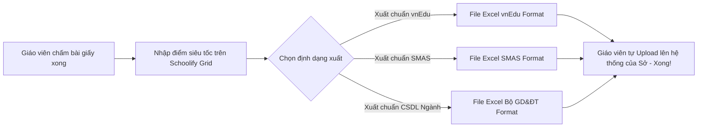

# TỬ HUYỆT 03: XUẤT ĐIỂM EXCEL CHUẨN MẪU vnEdu / SMAS / CSDL NGÀNH & BẢN CHẤT KIỂM TRA TRỰC TIẾP

> **Mã hồ sơ:** `PAIN-POINT-03`  
> **Phân loại:** Quản lý Điểm số & Tương thích Hạ tầng (Gradebook & Pragmatic Interoperability)  
> **Giải pháp kỹ thuật:** Universal Grade Excel Exporter & Template Injector (Xuất file Excel chuẩn hóa 1-Click)  
> **Nguyên tắc cốt lõi:** Thực tế - Tinh gọn - Không over-engineering - Không phụ thuộc hệ thống bên thứ ba.

---

## 1. THỰC TẾ CỐT LÕI: KIỂM TRA TRỰC TIẾP TRÊN LỚP VẪN LÀ CHÍNH

Một sai lầm kinh điển của các kỹ sư công nghệ là ảo tưởng rằng: *"Chuyển đổi số là 100% học sinh sẽ cầm điện thoại, laptop lên lớp làm bài thi trắc nghiệm online"*.

### 1.1. Thực tế trần trụi tại các trường học Việt Nam:
1. **Kiểm tra trực tiếp trên giấy vẫn chiếm 90%:**
   - Các bài kiểm tra 15 phút, kiểm tra 1 tiết, thi giữa kỳ và thi học kỳ tại các trường THCS, THPT và Tiểu học **vẫn bắt buộc làm trên giấy** (để chống gian lận, nhìn bài, tra cứu Google và tuân thủ quy chế thi của Bộ GD&ĐT).
   - Phần lớn trường công lập **không có đủ phòng máy tính** hoặc không cho phép học sinh mang điện thoại vào lớp học.
2. **Quy trình thực tế của người thầy:**
   - Thầy cô phát đề giấy -> Học sinh làm bài -> Thầy cô thu bài về nhà chấm bằng bút đỏ.
   - Thầy cô có một xấp bài thi đã chấm điểm trên tay.
   - **Nhiệm vụ duy nhất còn lại:** Làm sao để **nhập những con điểm trên giấy này vào hệ thống và nộp lên cấp trên một cách NHANH NHẤT, KHÔNG BỊ SAI SÓT**.

---

## 2. NỖI ĐAU THỰC SỰ: SỰ "LỆCH PHA" GIỮA CÁC MẪU FILE EXCEL

Nỗi khổ lớn nhất của giáo viên khi quản lý điểm số không phải là thiếu phần mềm thi online, mà là **ma trận các file Excel không khớp nhau**:

```
+-----------------------------------------------------------------------------------------------+
|                            MA TRẬN LỆCH PHA CÁC FILE EXCEL ĐIỂM SỐ                            |
|                                                                                               |
|  [Mẫu Sổ điểm vnEdu]              [Mẫu Sổ điểm SMAS]              [Mẫu CSDL Ngành Bộ GD&ĐT]   |
|  - Cột ẩn mã HS nội bộ VNPT       - Cấu trúc cột riêng            - Mã định danh quốc gia     |
|  - Ký hiệu: ĐĐGtx1, ĐĐGtx2...     - Ký hiệu: Miệng, 15p, 1 tiết   - Cấu trúc bảng biểu khác   |
|                                                                                               |
|       ^                                   ^                                   ^               |
|       |                                   |                                   |               |
|  [Giáo viên]: Ngồi copy-paste thủ công giữa các file Excel -> Rất dễ LỆCH DÒNG (điểm em này   |
|               nhảy sang em khác), sai định dạng dấu phẩy/chấm (7.5 vs 7,5) -> Hệ thống lỗi!   |
+-----------------------------------------------------------------------------------------------+
```

- **Rủi ro lệch dòng kinh hoàng:** Danh sách lớp 45 học sinh, giáo viên chỉ cần copy paste lệch 1 dòng là cả lớp bị xáo trộn điểm từ trên xuống dưới.
- **Rào cản kỹ thuật của vnEdu:** File Excel của vnEdu có các cột mã ẩn. Nếu giáo viên tự tạo file Excel ngoài để nạp vào, vnEdu sẽ từ chối ngay lập tức.

---

## 3. GIẢI PHÁP THỰC DỤNG CỦA SCHOOLIFY: "UNIVERSAL GRADEBOOK & 1-CLICK EXCEL EXPORTER"

Thay vì cố gắng "hack" endpoint hay xây dựng các extension phức tạp dễ bị lỗi khi nhà mạng đổi giao diện, Schoolify chọn **cách tiếp cận thực tế, an toàn 100% và tôn trọng quy trình của giáo viên**:



### 3.1. Tính năng 1: Giao diện Nhập điểm Siêu Tốc (Numpad-First Grid)
- Giao diện Sổ điểm của Schoolify được tối ưu hóa cho giáo viên cầm xấp bài thi giấy bằng tay trái, tay phải gõ bàn phím số (Numpad):
  - **Auto-Advance:** Gõ số `8` -> Tự động nhảy con trỏ xuống học sinh tiếp theo mà không cần bấm Enter hay dùng chuột.
  - **Auto-Save:** Lưu điểm tức thì theo từng mili-giây (Local Storage + Backend Sync), không bao giờ sợ mất dữ liệu vì rớt mạng hay mất điện.
  - **Validation thông minh:** Gõ nhầm điểm `85` thay vì `8.5` -> Hệ thống phát âm thanh cảnh báo và tự sửa thành `8.5`.

### 3.2. Tính năng 2: Xuất file Excel chuẩn 100% cho từng hệ thống
Schoolify tích hợp sẵn các Engine xuất Excel chuẩn hóa:
- **Nút: "Xuất Excel cho vnEdu":** Tự động format chuẩn cột `ĐĐGtx`, `ĐĐGgk`, `ĐĐGck`, định dạng font chữ, công thức làm tròn điểm đúng quy chuẩn của VNPT.
- **Nút: "Xuất Excel cho SMAS":** Tự động format đúng cấu trúc file của Viettel.
- **Nút: "Xuất Excel CSDL Ngành (Bộ GD&ĐT)":** Khớp 100% với cổng `csdl.moet.gov.vn`.

### 3.3. Tính năng 3: "Template Injector" (Kéo thả file mẫu - Điền điểm tự động)
- Đây là tính năng "ăn tiền" nhất giải quyết triệt để vấn đề cột ẩn của vnEdu:
  1. Giáo viên tải file Excel mẫu trắng từ vnEdu về máy.
  2. Kéo thả file mẫu đó vào Schoolify.
  3. Schoolify đọc mã học sinh từ file mẫu, tự động điền các con điểm từ Schoolify vào đúng các ô, giữ nguyên 100% các cột ẩn và định dạng của vnEdu.
  4. Trả ra file Excel đã điền đầy đủ điểm số cho giáo viên tải về.
  5. Giáo viên chỉ việc upload file đó lên vnEdu -> **Hệ thống vnEdu nhận diện hợp lệ 100% ngay lập tức!**

---

## 4. TẠI SAO HƯỚNG ĐI NÀY LÀ KHÔN NGOAN NHẤT?

1. **Zero Pháp Lý & Zero Rủi Ro:**
   - Không can thiệp vào server vnEdu, không lưu mật khẩu giáo viên, không bị nhà mạng tố cáo là "tấn công hay can thiệp hệ thống".
2. **Bền vững vĩnh viễn (Maintenance-free):**
   - Dù vnEdu có đổi giao diện web, đổi server hay nâng cấp tường lửa, tính năng xuất file Excel của chúng ta **không bao giờ bị ảnh hưởng**.
3. **Phù hợp thói quen thực tế 100%:**
   - Giáo viên vẫn có cảm giác an toàn vì họ được tự tay kiểm tra file Excel trước khi nộp lên hệ thống chính thức của nhà trường.
4. **Tiết kiệm chi phí phát triển:**
   - Không tốn tài nguyên duy trì và bảo trì Chrome Extension hay dịch vụ proxy tốn kém.

---

> **TRẠNG THÁI HỒ SƠ:** ĐÃ DUYỆT CHIẾN LƯỢC ĐƠN GIẢN HÓA & THỰC DỤNG  
> **Hạng mục kỹ thuật:** Xây dựng module `GradeExcelService` hỗ trợ export template vnEdu/SMAS/MOET trong Backend NestJS.
