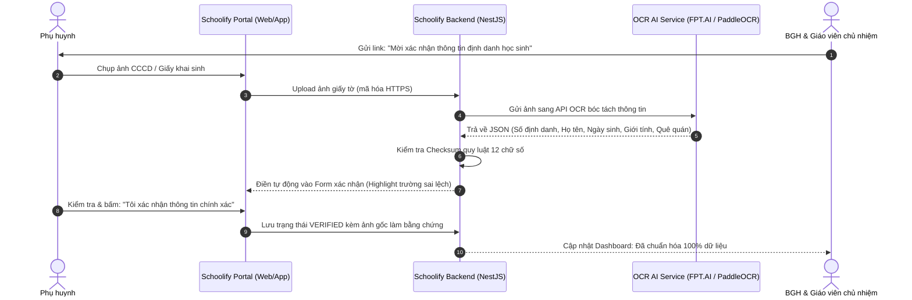

# TỬ HUYỆT 04: KHỦNG HOẢNG SAI LỆCH MÃ ĐỊNH DANH VNeID & GIẢI PHÁP TÍCH HỢP API OCR / XÁC THỰC CCCD TỰ ĐỘNG

> **Mã hồ sơ:** `PAIN-POINT-04`  
> **Phân loại:** Dữ liệu Quốc gia & Quản lý Danh tính Học sinh (National Identity & Data Cleansing)  
> **Giải pháp kỹ thuật:** OCR Bóc tách thông tin CCCD/Giấy khai sinh + Thuật toán Checksum 12 số + Cổng tự xác thực Self-Service  
> **Mục tiêu:** 100% dữ liệu học sinh khớp chuẩn Đề án 06, giải phóng giáo viên khỏi việc đi đòi giấy tờ thủ công.

---

## 1. BỐI CẢNH & THỰC TRẠNG: CƠN ÁC MỘNG ĐỀ ÁN 06 TẠI CÁC TRƯỜNG HỌC

Theo chỉ đạo của Chính phủ về **Đề án 06 (Phát triển ứng dụng dữ liệu dân cư, định danh và xác thực điện tử)**, Bộ GD&ĐT bắt buộc:
- 100% học sinh các cấp phải được xác thực đúng **Số định danh cá nhân 12 chữ số** (trên thẻ Căn cước công dân gắn chip hoặc Giấy khai sinh) khớp với Cơ sở dữ liệu Quốc gia về Dân cư.
- Dữ liệu này là điều kiện tiên quyết để: Đăng ký thi tốt nghiệp THPT, thi tuyển sinh vào lớp 10, xét tuyển đại học và cấp học bạ điện tử số hóa.

### Nỗi thống khổ của Giáo viên chủ nhiệm & Nhà trường:
1. **Dữ liệu vênh và sai lệch trầm trọng:**
   - Ngày sinh trên giấy khai sinh bị đảo thứ tự tháng/ngày so với cơ sở dữ liệu công an (`05/06` vs `06/05`).
   - Họ tên có dấu/không dấu, sai một chữ đệm.
   - Nhập thủ công bằng tay: Cả trường 1.500 học sinh, giáo viên gõ tay hàng vạn con số vào Excel -> Chỉ cần gõ nhầm 1 số là hệ thống quốc gia từ chối đồng bộ.
2. **Giáo viên bị biến thành "Cảnh sát điều tra dân số":**
   - Tối nào cô giáo cũng phải nhắn tin Zalo, gọi điện giục phụ huynh chụp ảnh CCCD gửi cô.
   - Phụ huynh chụp ảnh mờ, méo, mất góc, hoặc phàn nàn: *"Năm ngoái nộp rồi sao năm nay lại đòi?"*.

---

## 2. KIẾN TRÚC GIẢI PHÁP: TÍCH HỢP API OCR & XÁC THỰC CCCD TỰ ĐỘNG

Schoolify số hóa toàn bộ quy trình này bằng luồng: **Chụp ảnh -> OCR bóc tách thông tin trong 1.5 giây -> Kiểm tra quy luật Checksum 12 số -> Phụ huynh bấm 1-Click xác nhận**.



---

## 3. THIẾT KẾ KỸ THUẬT CHI TIẾT (TECHNICAL SPECIFICATION)

### 3.1. Lựa chọn Engine OCR & Xác thực tại Việt Nam

Schoolify hỗ trợ cơ chế kiến trúc lai (Hybrid OCR Strategy):

| Lựa chọn | Nhà cung cấp | Ưu điểm | Chi phí |
| :--- | :--- | :--- | :--- |
| **Lựa chọn 1: Cloud SaaS API** | **FPT.AI Reader / VNPT eKYC** | - Độ chính xác 99.5% với mọi loại CCCD gắn chip, mã vạch.<br>- Nhận diện được cả ảnh chụp nghiêng, lóa sáng.<br>- Có tính năng chống làm giả (Anti-spoofing). | Khoảng **300đ - 500đ / lượt quét** (Mỗi học sinh chỉ quét 1 lần trong cả năm học). |
| **Lựa chọn 2: Self-hosted Open Source** | **PaddleOCR Vietnamese / VietOCR** | - Chạy trực tiếp trên Docker nội bộ của Schoolify.<br>- Bảo mật dữ liệu tuyệt đối (không gửi ảnh ra bên thứ 3). | **0 VNĐ** (Miễn phí hoàn toàn). |

---

### 3.2. Thuật toán Kiểm tra Tính Hợp lệ 12 Số Định Danh (National ID Checksum)

Mã định danh cá nhân 12 số của Việt Nam có cấu trúc toán học xác định theo quy định của Bộ Công an:

$$\underbrace{\text{XXX}}_{\text{Mã tỉnh/thành}} \quad \underbrace{\text{X}}_{\text{Thế kỷ \& Giới tính}} \quad \underbrace{\text{XX}}_{\text{Năm sinh}} \quad \underbrace{\text{XXXXXX}}_{\text{Số ngẫu nhiên}}$$

- **Bảng quy chuẩn Mã Thế kỷ & Giới tính:**
  - Thế kỷ 20 (Sinh 1900 - 1999): Nam = `0`, Nữ = `1`.
  - Thế kỷ 21 (Sinh 2000 - 2099 - đối tượng học sinh hiện nay): **Nam = `2`, Nữ = `3`**.
  - Thế kỷ 22 (Sinh 2100 - 2199): Nam = `4`, Nữ = `5`.

**Thuật toán thẩm định trong Backend NestJS:**
```typescript
export function validateVietnameseNationalId(
  idNumber: string,
  birthDate: Date,
  gender: 'MALE' | 'FEMALE',
): { isValid: boolean; errorReason?: string } {
  if (!/^\d{12}$/.test(idNumber)) {
    return { isValid: false, errorReason: 'Mã định danh phải chứa đúng 12 chữ số' };
  }

  const birthYear = birthDate.getFullYear();
  const yearSuffix = birthYear.toString().slice(-2);
  const idYearSuffix = idNumber.slice(4, 6);

  // 1. Kiểm tra 2 số cuối của năm sinh
  if (yearSuffix !== idYearSuffix) {
    return {
      isValid: false,
      errorReason: `Năm sinh (${birthYear}) không khớp với 2 số trong mã định danh (${idYearSuffix})`,
    };
  }

  // 2. Kiểm tra mã giới tính & thế kỷ
  const genderCode = parseInt(idNumber.charAt(3), 10);
  let expectedGenderCode: number;
  if (birthYear >= 2000 && birthYear <= 2099) {
    expectedGenderCode = gender === 'MALE' ? 2 : 3;
  } else {
    expectedGenderCode = gender === 'MALE' ? 0 : 1;
  }

  if (genderCode !== expectedGenderCode) {
    return {
      isValid: false,
      errorReason: `Mã giới tính/thế kỷ (${genderCode}) không khớp với giới tính thực tế (${gender})`,
    };
  }

  return { isValid: true };
}
```

---

### 3.3. Database Schema Mở Rộng (`schema.prisma`)

```prisma
enum IdentityDocType {
  CCCD_CHIP          // Căn cước công dân gắn chip
  CCCD_BARCODE       // Căn cước mã vạch cũ
  BIRTH_CERTIFICATE  // Giấy khai sinh (cho học sinh cấp 1 chưa làm CCCD)
}

enum VerificationStatus {
  UNVERIFIED         // Chưa xác thực
  PENDING_REVIEW     // Chờ đối soát (nếu OCR phát hiện lệch thông tin)
  VERIFIED           // Đã xác thực thành công chuẩn Đề án 06
  REJECTED           // Bị từ chối do ảnh mờ/giấy tờ giả
}

model StudentIdentityRecord {
  id                 String             @id @default(uuid())
  student_id         String             @unique
  national_id_number String             // 12 chữ số định danh cá nhân
  doc_type           IdentityDocType    @default(CCCD_CHIP)
  
  // Dữ liệu bóc tách từ OCR
  extracted_fullname String
  extracted_dob      DateTime
  extracted_gender   String
  extracted_address  String?
  
  // Ảnh bằng chứng lưu trữ bảo mật (S3/MinIO mã hóa AES-256)
  front_image_url    String
  back_image_url     String?
  ocr_raw_response   Json?
  
  status             VerificationStatus @default(UNVERIFIED)
  verified_by_parent Boolean            @default(false)
  verified_at        DateTime?
  rejection_reason   String?
  created_at         DateTime           @default(now())
  updated_at         DateTime           @updatedAt

  student            StudentProfile     @relation(fields: [student_id], references: [id])
}
```

---

## 4. QUY TRÌNH TRẢI NGHIỆM NGƯỜI DÙNG (UX FLOW 3 BƯỚC KHÔNG CHẠM)

```
+-----------------------------------------------------------------------------------------------+
|  CỔNG XÁC THỰC ĐỊNH DANH HỌC SINH - SCHOOLIFY                                                  |
|                                                                                               |
|  Bước 1: [📸 Chụp mặt trước CCCD / Giấy khai sinh]                                            |
|          -> AI đang quét thông tin... (1.5 giây)                                              |
|                                                                                               |
|  Bước 2: Kết quả trích xuất tự động:                                                          |
|          - Họ và tên:       [ NGUYỄN VĂN AN           ] (Khớp 100%)                           |
|          - Số định danh:    [ 001212009876            ] (Hợp lệ chuẩn Đề án 06)               |
|          - Ngày sinh:       [ 15/08/2012              ] (Khớp hồ sơ lớp)                      |
|          - Giới tính:       [ Nam                     ] (Khớp)                                |
|                                                                                               |
|  Bước 3: [v] Tôi cam kết thông tin từ ảnh chụp trên là chính xác và chịu trách nhiệm trước PL |
|          [ Nút: XÁC NHẬN & CẬP NHẬT HỒ SƠ ]                                                   |
+-----------------------------------------------------------------------------------------------+
```

---

## 5. BẢO MẬT & PHÁP LÝ (NGHỊ ĐỊNH 13/2023/NĐ-CP)

Dữ liệu căn cước công dân của trẻ em là dữ liệu cá nhân nhạy cảm:
1. **Mã hóa lưu trữ (At-Rest Encryption):** Mọi ảnh chụp CCCD/giấy khai sinh phải được mã hóa bằng chuẩn **AES-256** trước khi lưu trữ vào Storage.
2. **Che mờ thông tin không cần thiết (Data Masking):** Trên giao diện của giáo viên, số CCCD được che bớt: `001212*****76` để tránh lộ lọt thông tin cá nhân.
3. **Phân quyền truy cập nghiêm ngặt:** Chỉ có Hiệu trưởng, Giáo vụ trường và chính Phụ huynh của học sinh đó mới có quyền xem ảnh chụp giấy tờ gốc.

---

> **TRẠNG THÁI HỒ SƠ:** ĐÃ DUYỆT ĐẶC TẢ TÍCH HỢP API VÀ THIẾT KẾ HỆ THỐNG  
> **Kế hoạch triển khai:** Xây dựng module `StudentIdentityModule` và tích hợp service OCR (FPT.AI / PaddleOCR) trong Backend NestJS.
