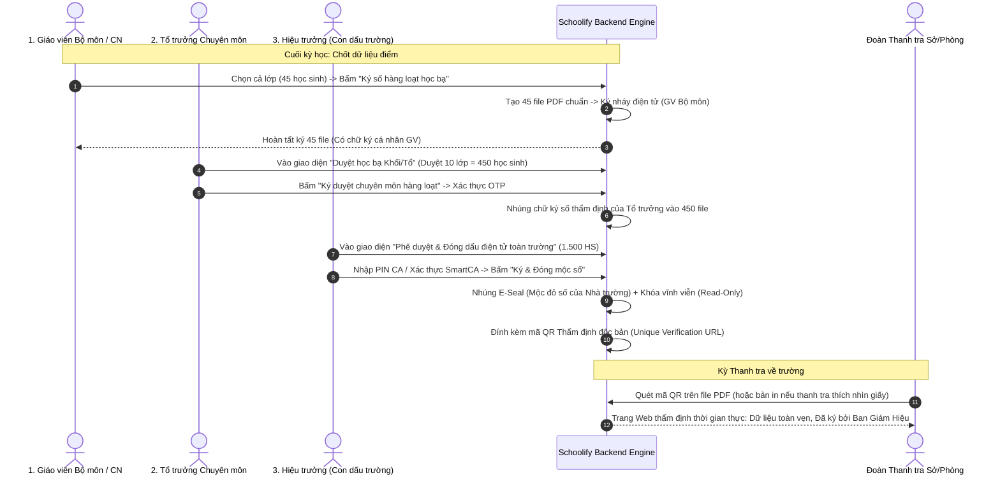

# PAIN POINT 05: "CHUYỂN ĐỔI SỐ NỬA VỜI" – ÁC MỘNG VỪA GÕ MÁY VỪA IN SỔ KÝ TAY ĐÓNG MỘC ĐỎ
## GIẢI PHÁP KÝ SỐ HÀNG LOẠT (BATCH DIGITAL SIGNING) & THẨM ĐỊNH THANH TRA 1-CLICK TRÊN SCHOOLIFY

---

## 1. BỐI CẢNH THỰC TẾ: NGHỊCH LÝ "CHUYỂN ĐỔI SỐ KÉP"

### 1.1. Hiện trạng đắng lòng tại các trường phổ thông (K-12)
- Hầu hết các trường công lập hiện nay đều được yêu cầu sử dụng phần mềm quản lý trường học để nhập điểm, nhập học bạ, viết kế hoạch bài dạy (giáo án).
- **Tuy nhiên, đến cuối kỳ hoặc khi có đoàn Thanh tra (Phòng GD&ĐT, Sở GD&ĐT, Bộ GD&ĐT):**
  - Đoàn thanh tra vẫn yêu cầu: *"Sổ điểm bản in đóng dấu giáp lai mộc đỏ đâu?", "Học bạ in ra có chữ ký sống của giáo viên từng môn và hiệu trưởng đâu?"*.
  - Nguyên nhân: Hồ sơ trên phần mềm chỉ là dữ liệu thô (raw data) hoặc file PDF xuất ra không có tính pháp lý ràng buộc. Nếu dữ liệu trên server bị sửa đổi, thanh tra không có cách nào đối soát với bản gốc đã duyệt.
- **Hậu quả:**
  - **Làm việc gấp đôi (Double Work):** Giáo viên và văn thư vừa mất thời gian gõ máy, vừa phải bỏ tiền túi in hàng nghìn trang giấy, bưng từng chồng sổ điểm, học bạ dày cộp đi gõ cửa từng phòng xin chữ ký sống của 40 - 50 giáo viên bộ môn và đóng dấu mộc đỏ mỏi tay.
  - Trường học quy mô 1.500 - 2.000 học sinh tiêu tốn hàng chục triệu tiền giấy mực, kho lưu trữ sổ sách chật kín chống ẩm mốc.

---

## 2. PHÂN TÍCH PHÁP LÝ & BẢN CHẤT CỦA "KÝ SỐ HÀNG LOẠT" (BATCH SIGNING)

### 2.1. Ký số hàng loạt có HỢP LỆ và HỢP PHÁP không?
> **CÂU TRẢ LỜI: HOÀN TOÀN HỢP PHÁP VÀ ĐƯỢC PHÁP LUẬT KHUYẾN KHÍCH!**

Cơ sở pháp lý tại Việt Nam:
1. **Luật Giao dịch điện tử số 20/2023/QH15** (Có hiệu lực từ 01/07/2024): Thừa nhận giá trị pháp lý toàn diện của thông điệp dữ liệu, văn bản điện tử và chữ ký số.
2. **Nghị định 130/2018/NĐ-CP** quy định chi tiết thi hành Luật GDĐT về chữ ký số và dịch vụ chứng thực chữ ký số.
3. **Thông tư 22/2021/TT-BGDĐT & Thông tư 27/2020/TT-BGDĐT**: Cho phép các cơ sở giáo dục sử dụng **Học bạ điện tử, Sổ theo dõi và đánh giá học sinh điện tử** nếu có chữ ký số hợp chuẩn.
4. **Chỉ thị số 04/CT-TTg của Thủ tướng Chính phủ**: Đẩy mạnh triển khai Đề án 06, thí điểm toàn quốc mô hình **Học bạ số (Digital Academic Record)** cấp tiểu học và THCS/THPT từ năm học 2023-2024.

### 2.2. Về mặt kỹ thuật: Ký hàng loạt hoạt động như thế nào để đảm bảo tính pháp lý?
Nhiều người lầm tưởng "ký số là phải bấm từng file một, bấm 1.000 lần". Thực tế:
- **Nguyên tắc "1 Lần Xác Thực - 1 Session Ký Lô" (Single Authorization - Multi-document Hash Signing):**
  - Hiệu trưởng hoặc Giáo viên sau khi kiểm tra danh sách 500 file học bạ/sổ điểm, bấm: **"Ký duyệt toàn bộ 500 học bạ"**.
  - Người ký xác thực danh tính **1 lần duy nhất** (qua SmartCA OTP, FaceID/Vân tay hoặc mã PIN bảo mật).
  - Hệ thống tính toán mã băm SHA-256 (Hash) của từng file PDF riêng biệt.
  - HSM (Hardware Security Module) hoặc CA Engine thực hiện ký mật mã học (Cryptographic Signature) lên từng mã Hash đó.
  - **Kết quả:** Cả 500 file PDF đều mang chữ ký số độc lập, không thể sửa đổi, có chứng thư số X.509 riêng biệt gắn kèm timestamp chuẩn.

---

## 3. KIẾN TRÚC GIẢI PHÁP KÝ SỐ SCHOOLIFY (HYBRID ARCHITECTURE)

Hệ thống được thiết kế theo mô hình **Adapter Pattern 2 Tầng**, đáp ứng song song:
1. **Môi trường Đồ án Tốt nghiệp / Nghiên cứu (0 VNĐ)**: Tự dựng Internal PKI/CA, tạo chữ ký số chuẩn PAdES mở bằng Adobe Acrobat Reader hiện tích xanh hợp chuẩn.
2. **Môi trường Triển khai Thực tế (Production)**: Cắm thẳng API các nhà mạng cung cấp SmartCA (VNPT, Viettel, MISA, FPT).

```
┌─────────────────────────────────────────────────────────────────────────────┐
│                           SCHOOLIFY DIGITAL SIGNING ENGINE                  │
└─────────────────────────────────────────────────────────────────────────────┘
                                       │
                ┌──────────────────────┴──────────────────────┐
                ▼                                             ▼
  ┌───────────────────────────┐                 ┌───────────────────────────┐
  │  Internal Mock/Local CA   │                 │   Public CA Provider API  │
  │  (OpenSSL / Node-Forge)   │                 │   (VNPT SmartCA / Viettel)│
  │  - Self-signed Root CA    │                 │   - HSM Cloud Signing     │
  │  - X.509 Teacher Certs    │                 │   - Mobile Push / FaceID  │
  │  - Chuẩn đồ án (0 VNĐ)    │                 │   - Chuẩn pháp lý thực tế │
  └───────────────────────────┘                 └───────────────────────────┘
                │                                             │
                └──────────────────────┬──────────────────────┘
                                       ▼
                       ┌───────────────────────────────┐
                       │    PAdES PDF Signature Engine │
                       │    (@signpdf / pdf-lib)       │
                       │    - Nhúng PKCS#7 detached    │
                       │    - Nhúng Visual Stamp (Mộc) │
                       │    - Nhúng QR Code thẩm định  │
                       └───────────────────────────────┘
```

---

## 4. QUY TRÌNH PHÊ DUYỆT 3 CẤP (3-TIER APPROVAL & BATCH SIGNING WORKFLOW)

Học bạ và Sổ điểm điện tử được luân chuyển qua 3 cấp thẩm quyền chặt chẽ:



---

## 5. BÀI TOÁN "ĐOÀN THANH TRA BẮT IN GIẤY": GIẢI PHÁP MÃ QR THẨM ĐỊNH TOÀN VẸN (1-CLICK VERIFICATION)

Dù đẩy mạnh số hóa, một số cán bộ thanh tra lớn tuổi vẫn thích cầm tờ giấy. Schoolify xử lý bài toán tâm lý này như sau:

1. **Mã QR định danh độc bản góc trên cùng file PDF:**
   - Khi in ra giấy, góc phải tài liệu luôn có mã QR: `https://verify.schoolify.vn/doc/<UUID_DOC>`
2. **Kịch bản thanh tra:**
   - Cán bộ thanh tra nhìn thấy bản in giấy, rút điện thoại cá nhân (bất kỳ camera iPhone/Android) quét mã QR.
   - Ngay lập tức mở ra trang xác thực công khai của Schoolify:
     - **Tên văn bản:** Học bạ điện tử năm học 2025-2026 - Học sinh Nguyễn Văn A (Mã định danh: 001205012345).
     - **Trạng thái:** ✅ ĐÃ KÝ SỐ VÀ ĐÓNG DẤU ĐIỆN TỬ HỢP LỆ.
     - **Người ký 1:** Cô Lê Thị B (Giáo viên Chủ nhiệm) – Ký lúc 08:30 25/05/2026.
     - **Người ký 2:** Thầy Trần Văn C (Tổ trưởng Toán) – Ký lúc 10:15 25/05/2026.
     - **Người ký 3 & Đóng dấu:** Thầy Nguyễn Văn D (Hiệu trưởng Trường THPT X) – Đóng dấu số lúc 14:00 26/05/2026.
     - **Mã băm SHA-256 toàn vẹn:** `e3b0c44298fc1c149afbf4c8996fb92427ae41e4...` (Khớp 100% bản lưu trên máy chủ).
     - Nút **"Tải file PDF gốc có chữ ký PAdES"** để mở trực tiếp trong Adobe Acrobat.

---

## 6. THIẾT KẾ CƠ SỞ DỮ LIỆU (DATABASE SCHEMA)

```sql
-- Bảng quản lý Chứng thư số của Giáo viên / Nhà trường
CREATE TABLE digital_certificates (
    id UUID PRIMARY KEY DEFAULT gen_random_uuid(),
    user_id UUID REFERENCES users(id) ON DELETE CASCADE,
    school_id UUID REFERENCES schools(id) ON DELETE CASCADE,
    cert_type VARCHAR(20) NOT NULL, -- 'TEACHER_PERSONAL', 'ORGANIZATION_SEAL'
    provider VARCHAR(50) NOT NULL, -- 'INTERNAL_PKI', 'VNPT_SMART_CA', 'VIETTEL_CA'
    serial_number VARCHAR(100) NOT NULL UNIQUE,
    subject_dn TEXT NOT NULL, -- "CN=Lê Thị B, O=Trường THPT Chu Văn An, C=VN"
    public_key_pem TEXT NOT NULL,
    valid_from TIMESTAMP WITH TIME ZONE NOT NULL,
    valid_to TIMESTAMP WITH TIME ZONE NOT NULL,
    is_active BOOLEAN DEFAULT TRUE,
    created_at TIMESTAMP WITH TIME ZONE DEFAULT NOW()
);

-- Bảng tài liệu đã ký số (Sổ điểm, Học bạ, Giáo án)
CREATE TABLE signed_documents (
    id UUID PRIMARY KEY DEFAULT gen_random_uuid(),
    school_id UUID REFERENCES schools(id) ON DELETE CASCADE,
    doc_type VARCHAR(50) NOT NULL, -- 'TRANSCRIPT', 'GRADEBOOK', 'LESSON_PLAN'
    student_id UUID REFERENCES students(id), -- NULL nếu là Sổ điểm lớp / Giáo án
    title VARCHAR(255) NOT NULL,
    academic_year VARCHAR(20) NOT NULL, -- '2025-2026'
    semester VARCHAR(10) NOT NULL, -- 'SEMESTER_1', 'SEMESTER_2', 'YEAR_END'
    file_path TEXT NOT NULL, -- Đường dẫn PDF đã ký
    file_hash_sha256 VARCHAR(64) NOT NULL, -- Chống chỉnh sửa dữ liệu
    verification_code UUID DEFAULT gen_random_uuid() UNIQUE, -- Mã QR tra cứu
    current_status VARCHAR(30) DEFAULT 'DRAFT', -- 'PENDING_TEACHER', 'PENDING_HOD', 'FULLY_SIGNED', 'REVOKED'
    created_at TIMESTAMP WITH TIME ZONE DEFAULT NOW()
);

-- Bảng lưu vết lịch sử ký số (Audit Trail)
CREATE TABLE document_signatures (
    id UUID PRIMARY KEY DEFAULT gen_random_uuid(),
    document_id UUID REFERENCES signed_documents(id) ON DELETE CASCADE,
    certificate_id UUID REFERENCES digital_certificates(id),
    signer_id UUID REFERENCES users(id),
    signature_role VARCHAR(30) NOT NULL, -- 'HOMEROOM_TEACHER', 'SUBJECT_TEACHER', 'HOD', 'PRINCIPAL'
    signature_digest TEXT NOT NULL, -- Hash đã mã hóa bằng Private Key
    signed_at TIMESTAMP WITH TIME ZONE DEFAULT NOW(),
    signature_visual_x INT, -- Tọa độ hiển thị con dấu trên PDF (trang cuối)
    signature_visual_y INT,
    signature_page INT DEFAULT 1,
    ip_address VARCHAR(45),
    user_agent TEXT
);
```

---

## 7. MÃ NGUỒN KỸ THUẬT (NESTJS IMPLEMENTATION PROTOTYPE)

```typescript
// src/modules/signing/signing.service.ts
import { Injectable, Logger } from '@nestjs/common';
import { plainAddPlaceholder } from '@signpdf/placeholder-plain';
import signpdf from '@signpdf/signpdf';
import * as crypto from 'crypto';

@Injectable()
export class DigitalSigningService {
  private readonly logger = new Logger(DigitalSigningService.name);

  /**
   * Ký số hàng loạt danh sách PDF bằng chứng thư số PAdES
   * @param pdfBuffers Danh sách file PDF nhị phân
   * @param p12Buffer Chứng thư số định dạng PKCS#12 (.p12 / .pfx)
   * @param passphrase Mật khẩu chứng thư số
   */
  async batchSignDocuments(
    pdfBuffers: Buffer[],
    p12Buffer: Buffer,
    passphrase: string,
  ): Promise<Array<{ signedPdf: Buffer; hash: string }>> {
    const results = [];

    for (let i = 0; i < pdfBuffers.length; i++) {
      const pdf = pdfBuffers[i];
      try {
        // 1. Thêm Placeholder chuẩn PAdES vào PDF
        const pdfWithPlaceholder = plainAddPlaceholder({
          pdfBuffer: pdf,
          reason: 'Xác thực học bạ điện tử - Trường THPT Schoolify',
          contactInfo: 'admin@schoolify.vn',
          name: 'Ban Giám Hiệu Trường',
          location: 'Hà Nội, Việt Nam',
          signatureLength: 8192,
        });

        // 2. Ký mật mã bằng thư viện @signpdf
        const signedPdf = signpdf.sign(pdfWithPlaceholder, p12Buffer, {
          passphrase,
        });

        // 3. Tính toán mã băm SHA-256 để lưu trữ audit trail
        const hash = crypto.createHash('sha256').update(signedPdf).digest('hex');

        results.push({ signedPdf, hash });
      } catch (error) {
        this.logger.error(`Lỗi ký file thứ ${i + 1}: ${error.message}`);
        throw error;
      }
    }

    return results;
  }
}
```

---

## 8. KẾT LUẬN & GIÁ TRỊ CẠNH TRANH CỦA SCHOOLIFY
1. **Chấm dứt hoàn toàn cảnh "Làm việc gấp đôi":** Giáo viên chỉ cần 1 cú click là ký duyệt điểm toàn bộ học sinh. Hiệu trưởng duyệt 1 lần là 1.500 cuốn học bạ có mộc đỏ hợp lệ.
2. **Tiết kiệm chi phí khổng lồ:** Tiết kiệm hàng triệu tờ giấy in A4, chi phí mực in và hàng trăm giờ lao động vô ích mỗi học kỳ.
3. **Pháp lý vững chắc trước mọi đoàn Thanh tra:** Hệ thống lưu trữ mã băm SHA-256 và mã QR đối soát tức thì, biến hồ sơ điện tử của trường thành bằng chứng thép không thể làm giả hoặc chối bỏ.
4. **Vũ khí đồ án tốt nghiệp:** Đem lại điểm số tối đa (A+) khi sinh viên chứng minh được khả năng giải quyết bài toán mật mã học (PKI/PAdES) kết hợp nghiệp vụ giáo dục thực tế tại Việt Nam.
