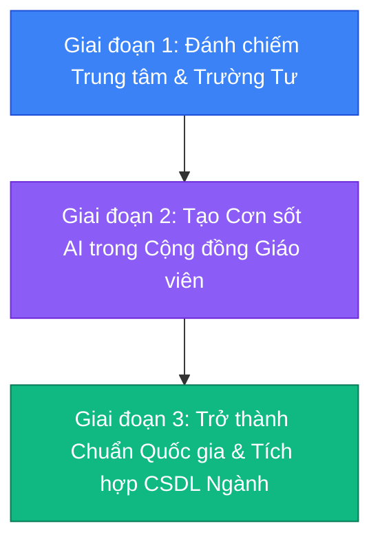

# BÁO CÁO CHIẾN LƯỢC: NHỮNG NỖI ĐAU NGẦM & THÁCH THỨC CỐT LÕI TRONG CHUYỂN ĐỔI SỐ GIÁO DỤC TOÀN QUỐC (VIETNAM EDTECH PAIN POINTS)

> **Tài liệu nghiên cứu nội bộ dành cho Ban dự án Schoolify**  
> **Mục tiêu:** Nhận diện toàn diện các rào cản chính sách, nghịch lý vận hành và nỗi đau thực tế của Giáo viên, Nhà trường, Phụ huynh nhằm xây dựng nền tảng chuyển đổi số giáo dục toàn quốc đạt chuẩn 100%.

---

## MỤC LỤC
1. [Bối Cảnh & Tham Vọng Nền Tảng Chuyển Đổi Số Quốc Gia](#1-bối-cảnh--tham-vọng-nền-tảng-chuyển-đổi-số-quốc-gia)
2. [Nhóm 1: Nỗi Đau Giáo Viên (Người Trực Tiếp Vận Hành)](#2-nhóm-1-nỗi-đau-giáo-viên-người-trực-tiếp-vận-hành)
3. [Nhóm 2: Nỗi Đau Quản Lý & Rào Cản Thể Chế (Bộ / Sở / Phòng GD&ĐT)](#3-nhóm-2-nỗi-đau-quản-lý--rào-cản-thể-chế-bộ--sở--phòng-gdđt)
4. [Nhóm 3: Nỗi Đau Phụ Huynh & Học Sinh (Khách Hàng Thụ Hưởng)](#4-nhóm-3-nỗi-đau-phụ-huynh--học-sinh-khách-hàng-thụ-hưởng)
5. [Nhóm 4: Bóc Tách Bản Chất Dòng Tiền & Ngân Sách Thực Tế](#5-nhóm-4-bóc-tách-bản-chất-dòng-tiền--ngân-sách-thực-tế)
6. [Chiến Lược Đột Phá Cho Schoolify (Binh Pháp Chiếm Lĩnh Thị Trường)](#6-chiến-lược-đột-phá-cho-schoolify-binh-pháp-chiếm-lĩnh-thị-trường)

---

## 1. BỐI CẢNH & THAM VỌNG NỀN TẢNG CHUYỂN ĐỔI SỐ QUỐC GIA

- **Chủ trương nhà nước:** Quyết định 131/QĐ-TTg của Thủ tướng Chính phủ và Đề án 06 thúc đẩy số hóa 100% học bạ, hồ sơ quản lý giáo dục và thanh toán học phí không dùng tiền mặt.
- **Thực tế nghịch lý:** Mặc dù hàng trăm tỷ đồng ngân sách đã đổ vào hạ tầng công nghệ thông tin trong 10 năm qua, chuyển đổi số giáo dục tại Việt Nam vẫn bị đánh giá là **"Manh mún - Cát cứ - Nặng tính hình thức - Làm khổ người dùng"**.
- **Căn nguyên thất bại của các đơn vị công nghệ trước đây:** Xây dựng phần mềm theo tư duy hành chính công (áp đặt từ trên xuống) hoặc tư duy thuần kỹ thuật mà **không hiểu tâm lý sư phạm, áp lực kiểm tra thanh tra và thói quen sinh hoạt của người Việt**.

---

## 2. NHÓM 1: NỖI ĐAU GIÁO VIÊN (NGƯỜI TRỰC TIẾP VẬN HÀNH)

Giáo viên là đối tượng quyết định sự thành bại của bất kỳ phần mềm giáo dục nào. Nếu giáo viên ghét và cảm thấy bị phiền hà, họ sẽ tìm mọi cách đối phó.

### 2.1. Nghịch lý "Chuyển đổi số kép": Làm việc gấp đôi!
- **Thực trạng:** 
  - Khẩu hiệu là "Học bạ điện tử, Sổ điểm điện tử".
  - Nhưng khi các đoàn Thanh tra Sở GD&ĐT, Phòng GD&ĐT hoặc kiểm định chất lượng về trường, họ **vẫn yêu cầu nộp SỔ SÁCH GIẤY IN ĐẦY ĐỦ CÓ CHỮ KÝ TAY VÀ DẤU ĐỎ MỘC TRÒN**.
- **Hậu quả:** Thay vì được giảm tải, giáo viên phải làm 2 lần công việc:
  1. Ngồi mòn mỏi nhập điểm, đánh giá trên máy tính.
  2. Xuất file in hàng nghìn trang giấy, ngồi ký tay mỏi nhừ từng trang học bạ, đóng dấu mộc lưu kho tủ sắt.
  > *"Trước kia chỉ mất công chép sổ tay một lần. Giờ vừa phải gõ máy, vừa phải in sổ ký tay, mệt mỏi gấp đôi!"* (Tâm sự chung của hàng vạn giáo viên).

### 2.2. Ác mộng "Viết lời nhận xét định tính" (Chương trình GDPT 2018)
- **Quy định pháp lý ngặt nghèo (Thông tư 22 và Thông tư 27):**
  - Không còn được đánh giá đơn thuần bằng con điểm 8, 9, 10. Giáo viên bắt buộc phải viết **nhận xét định tính cá nhân hóa** về *Năng lực cốt lõi* và *Phẩm chất* của từng học sinh.
  - Văn phong bắt buộc: Không được dùng từ tiêu cực (chê yếu, kém, lười), phải nêu đủ 3 vế: **[Ưu điểm] - [Hạn chế] - [Phương hướng rèn luyện]**.
- **Sự quá tải cùng cực:**
  - Một giáo viên bộ môn cấp 2 hoặc cấp 3 thường phụ trách từ 6 - 8 lớp (sĩ số khoảng **350 - 450 học sinh**).
  - Đến kỳ đánh giá cuối kỳ, họ phải viết **400 đoạn văn nhận xét hoàn toàn khác nhau** trong vòng 7-10 ngày.
  - **Hậu quả tiêu cực:** Giáo viên kiệt sức, thức trắng đêm, cuối cùng phải dùng chiêu "copy-paste" hàng loạt từ các file mẫu trôi nổi trên mạng. Dẫn đến sai sót ngớ ngẩn: Học sinh nam bị khen *"Em nết na, dịu dàng"*, học sinh yếu Toán bị nhận xét *"Em có tư duy hình học xuất sắc"*, làm giảm uy tín sư phạm nghiêm trọng.

### 2.3. Khoảng cách thế hệ & Năng lực số (Digital Divide)
- **Cơ cấu giáo viên hiện tại:** Rất nhiều thầy cô giáo kỳ cựu ở độ tuổi 45 - 55 tuổi (chiếm tỷ lệ lớn ở các trường công lập).
- **Rào cản:**
  - Thao tác máy tính chậm, mắt kém, gõ phím mổ cò.
  - Các phần mềm nhà nước hiện tại (vnEdu, SMAS) có giao diện bảng biểu chằng chịt, font chữ nhỏ li ti, hàng chục nút bấm gây hoang mang, sợ hãi bấm nhầm mất dữ liệu.
  - Chỉ cần gặp lỗi nhỏ (quên mật khẩu, lỗi font, mạng lag) là giáo viên bỏ cuộc và chuyển về làm thủ công.

---

## 3. NHÓM 2: NỖI ĐAU QUẢN LÝ & RÀO CẢN THỂ CHẾ (BỘ / SỞ / PHÒNG GD&ĐT)

### 3.1. "Cát cứ nhà mạng" & Ốc đảo dữ liệu (Data Silos / Vendor Lock-in)
- **Bản đồ thị phần cát cứ:**
  - **VNPT (vnEdu):** Thâu tóm và độc quyền khoảng 30 tỉnh thành.
  - **Viettel (SMAS):** Cát cứ độc quyền khoảng 25 tỉnh thành.
  - **eNetViet:** Thâu tóm thị trường Sổ liên lạc điện tử tại các đô thị lớn (Hà Nội, TP.HCM).
  - **MISA (MISA EMIS):** Chiếm lĩnh mảng phần mềm kế toán và quản lý tài sản trường học.
- **Vấn đề cốt tử:**
  - Các hệ thống này **KHÔNG CHỊU MỞ API ĐỂ LIÊN THÔNG VỚI NHAU** do cuộc chiến cạnh tranh thị phần viễn thông.
  - Bộ GD&ĐT có cổng **Cơ sở dữ liệu (CSDL) ngành**, nhưng cơ chế đồng bộ rất khổ sở: Giáo viên phải xuất dữ liệu từ vnEdu ra Excel, chỉnh sửa thủ công định dạng cột, rồi mới tải ngược lên cổng của Bộ.
  - **Sự đứt gãy học bạ:** Học sinh chuyển trường từ Tỉnh A (dùng vnEdu) sang Tỉnh B (dùng SMAS) -> Dữ liệu không đọc được của nhau, bắt buộc học sinh phải xin rút học bạ giấy, công chứng mang đi nộp lại từ đầu!

### 3.2. Ác mộng sai lệch "Mã Định Danh Cá Nhân" (Đề án 06 & VNeID)
- Khi đồng bộ cơ sở dữ liệu học sinh với Cơ sở dữ liệu Quốc gia về Dân cư:
  - Hàng triệu học sinh bị sai sót thông tin: Lệch ngày tháng năm sinh giữa giấy khai sinh và VNeID, sai quê quán, chưa có mã định danh cá nhân.
  - Hệ thống tự động từ chối đồng bộ hồ sơ học bạ số.
  - **Bi hài:** Giáo viên chủ nhiệm bị biến thành "công an khu vực", suốt ngày phải gọi điện giục phụ huynh chụp ảnh căn cước công dân để sửa lỗi từng dòng dữ liệu.

### 3.3. Trục trặc Chữ Ký Số (Smart CA / USB Token)
- Ký học bạ số yêu cầu chữ ký điện tử.
- Nhiều trường mua USB Token giá rẻ: Cắm vào máy tính bị lỗi driver, hết hạn chứng thư số, máy tính trường nhiễm virus chặn ký số.
- Ký hàng loạt 1.000 học sinh khiến trình duyệt bị treo, crash máy tính, gây ức chế tột cùng cho Ban giám hiệu.

---

## 4. NHÓM 3: NỖI ĐAU PHỤ HUYNH & HỌC SINH (KHÁCH HÀNG THỤ HƯỞNG)

### 4.1. Hội chứng "Bội thực ứng dụng" (App Fatigue)
Một phụ huynh có 2 đứa con đi học hiện nay phải cài trong điện thoại trung bình **4 đến 6 ứng dụng khác nhau**:
1. App xem điểm & sổ liên lạc: *eNetViet* hoặc *vnEdu Connect*.
2. App nộp tiền học: *Viettel Money*, *VNPT Money* hoặc ứng dụng ngân hàng riêng.
3. App xe đưa đón / camera trường mầm non.
4. App làm bài tập trực tuyến: *Azota*, *K12Online*, *Google Classroom*.
5. Và cuối cùng là... **Nhóm Zalo của lớp**.

### 4.2. Nghịch lý Zalo: Tại sao hệ thống tiền tỷ thua một nhóm chat miễn phí?
- Bất chấp nhà trường mua phần mềm quản lý hàng chục triệu, **95% việc trao đổi hàng ngày giữa giáo viên và phụ huynh vẫn diễn ra trên Zalo**.
- **Lý do:**
  - Zalo có sẵn trong máy mọi người dân Việt Nam, thông báo nảy tức thì (push notification 0 delay).
  - Trong khi đó, các app quản lý giáo dục hiện tại load rất chậm, hay bị văng, giao diện nặng nề, thông báo đến trễ hàng tiếng đồng hồ.

### 4.3. Cơn phẫn nộ về "Phí Sổ Liên Lạc Điện Tử" & Quảng cáo rác
- Phụ huynh bị bắt buộc đóng từ **80.000đ - 150.000đ/học sinh/năm** cho dịch vụ sổ liên lạc điện tử.
- **Nỗi bức xúc tột cùng:** 
  - Đã thu tiền của phụ huynh nhưng khi mở app ra xem điểm con, phụ huynh bị đập vào mắt hàng loạt **quảng cáo game, quảng cáo cho vay tiêu dùng, tin tức giật gân rẻ tiền**.
  - Sự phản ứng dữ dội của phụ huynh đã khiến Sở GD&ĐT nhiều tỉnh (như Nghệ An, Hà Tĩnh) phải **ra văn bản chính thức CẤM các trường thu tiền sổ liên lạc điện tử**.

---

## 5. NHÓM 4: BÓC TÁCH BẢN CHẤT DÒNG TIỀN & NGÂN SÁCH THỰC TẾ

| Phân khúc trường | Ngân sách & Khả năng chi trả | Ai là người ra quyết định? | Điểm nhạy cảm (Tử huyệt) |
| :--- | :--- | :--- | :--- |
| **Trường Công Lập** | - Ngân sách trường rất hạn hẹp cho phần mềm. - Doanh thu thực tế đến từ **Thỏa thuận thu hộ Phụ huynh** (100k - 200 triệu/trường/năm). | - Phụ thuộc Sở/Phòng GD&ĐT. - Hiệu trưởng sợ trách nhiệm tài chính. | **Sợ thanh tra lạm thu.** Nếu phần mềm minh bạch, có văn bản cho phép và không bị phụ huynh kiện là trường sẵn sàng dùng. |
| **Trường Tư Thục / Quốc Tế** | - Ngân sách dồi dào: Sẵn sàng chi **50 - 300 triệu/năm**. - Trả theo license/học sinh ($5 - $12/hs/năm). | - Chủ tịch HĐQT / Tổng Giám đốc / Giám đốc Học thuật. | **Thương hiệu & Đẳng cấp.** Phải có App riêng (White-label), giao diện sang trọng, không dính tên đơn vị khác, bảo mật dữ liệu tuyệt đối. |
| **Trung Tâm Ngoại Ngữ / Dạy Thêm** | - Chi trả: **15 - 50 triệu/năm**. - Sẵn sàng trả tiền tươi theo tháng/năm. | - Chủ trung tâm (Ra quyết định trong 1 buổi làm việc). | **Dòng tiền & Tiết kiệm chi phí.** Tự động đòi và gạch nợ học phí VietQR để sa thải bớt nhân viên giáo vụ; chống quay lén lộ bản quyền video bài giảng. |

---

## 6. CHIẾN LƯỢC ĐỘT PHÁ CHO SCHOOLIFY (BINH PHÁP CHIẾM LĨNH THỊ TRƯỜNG)

Muốn đạt mục tiêu chuyển đổi số quy mô quốc gia mà không bị các "gã khổng lồ viễn thông" nghiền nát, Schoolify phải đi theo **Chiến lược Nước Chảy Chỗ Trũng (Bottom-Up Product-Led Growth)**:

### 1. Không đối đầu trực diện ở mảng "Hành chính sổ sách" của nhà mạng
- Đừng cố làm lại một cái sổ điểm hành chính để cạnh tranh với vnEdu/SMAS tại các trường công ở bước đầu. Đó là sân sau của các nhà mạng có quan hệ chính trị hàng chục năm.
- **Hãy đánh vào mảng HỌC TẬP THỰC CHẤT (LMS & Đánh giá năng lực):** Nơi mà vnEdu và SMAS làm cực kỳ tệ. Tập trung vào: Kiểm tra đánh giá, chống gian lận, bài tập tương tác, kho tài nguyên đề thi.

### 2. Dùng AI làm "Vũ Khí Sát Thương Cao" (The Unfair Advantage)
Schoolify phải giải quyết đúng 2 việc khiến giáo viên cả nước biết ơn:
1. **Trợ lý AI viết lời nhận xét học sinh chuẩn Thông tư 22/27:** Bấm 1 nút sinh ngay lời nhận xét cá nhân hóa, đúng chuẩn sư phạm, cứu giáo viên khỏi 100 giờ thức đêm mỗi học kỳ.
2. **AI sinh đề thi từ tài liệu (Exam Generator):** Tải file PDF giáo án lên, AI tự động quét ra ma trận đề trắc nghiệm chuẩn Bộ GD&ĐT.

### 3. Trải nghiệm Phụ huynh "Nói KHÔNG với Quảng cáo"
- Định vị Schoolify là nền tảng giáo dục **trong sạch, đẳng cấp, nhân văn**.
- Tích hợp **VietQR tự động gạch nợ học phí trong 3 giây**, phụ huynh mở app quét mã ngân hàng là xong, không phải chụp màn hình gửi Zalo cho cô giáo.

### 4. Siêu nhẹ - Chạy mượt trên máy tính cũ & Mạng 3G
- Thiết kế hệ thống tối ưu dung lượng (Zero Bloatware). Giao diện trực quan đến mức một cô giáo 55 tuổi ở trường vùng cao nhìn vào biết bấm ngay trong 30 giây mà không cần đọc sách hướng dẫn dày cộp.

---

> **KẾT LUẬN KIM CHỈ NAM:**  
> *"Chuyển đổi số thành công không phải là đưa thật nhiều công nghệ vào trường học, mà là **lấy đi những gánh nặng hành chính vô lý** đang đè nặng lên vai người thầy, để họ có thời gian thực sự nhìn vào mắt học trò và giảng bài."*  
> **Schoolify sẽ chiến thắng nếu giải quyết được sự giải phóng sức lao động đó!**
